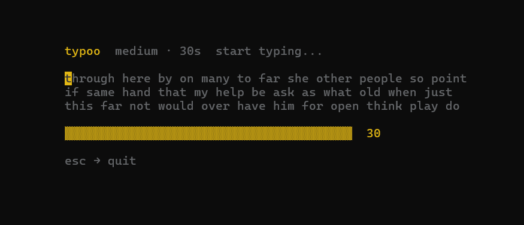
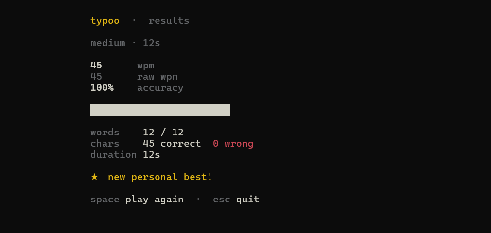

# typoo ⌨️

A minimal, beautiful **monkeytype-style** typing test that runs entirely in your terminal. No browser, no dependencies beyond chalk — just you and the keyboard.

<p align="center">
  
  
  
</p>

---

## ✨ Features

- **Word mode** — classic typing test with easy / medium / hard difficulty
- **Code mode** — type real JavaScript or Python snippets
- **Zen mode** — free typing, no targets, no timer, just vibes
- **Flicker-free rendering** — ANSI cursor-jump technique, no screen clearing
- **Personal bests** — automatically saved to `~/.typoo_pb.json`
- **Monkeytype aesthetics** — dark theme with gold/cream/red colour palette
- **Dynamic layout** — adapts to your terminal size in real-time
- **Zero config** — just install and type

---

## 📦 Install

### Windows

```bash
npm install -g typoo
```

### macOS / Linux

```bash
sudo npm install -g typoo
```

> **Don't want to use sudo?** Configure npm to use a user-writable directory:
> ```bash
> mkdir -p ~/.npm-global
> npm config set prefix '~/.npm-global'
> echo 'export PATH=~/.npm-global/bin:$PATH' >> ~/.bashrc  # or ~/.zshrc for zsh
> source ~/.bashrc
> npm install -g typoo
> ```

### From source

```bash
git clone https://github.com/Anshit-Gupta/typoo.git
cd typoo
npm install
npm link
```

---

## 📸 Screenshots

<p align="center">
  
  <br/><br/>
  
</p>

---

## 🚀 Usage

### Word mode

```bash
typoo                     # 30s medium test (default)
typoo 60                  # 60-second test
typoo easy                # easy difficulty, 30s
typoo hard 60             # hard difficulty, 60 seconds
typoo easy 15             # easy difficulty, 15 seconds
```

### Code mode

```bash
typoo code                # random language, 30s
typoo code js             # JavaScript snippets
typoo code py             # Python snippets
typoo code js 60          # JavaScript, 60 seconds
```

### Zen mode

```bash
typoo zen                 # free typing, no targets, no timer
```

Just type whatever you want. No pressure, no scoring against targets. Press **Enter** or stop typing for 3 seconds to see your stats.

### Other commands

```bash
typoo scores              # view personal bests
typoo help                # show all commands
typoo --version           # print version
```

---

## ⌨️ Controls

| Key | Action |
|-----|--------|
| any key | start timer + begin typing |
| `space` | submit current word (word mode) |
| `enter` | submit current line (code mode) |
| `backspace` | delete last character (or undo last word) |
| `esc` | quit |
| `ctrl+c` | quit |

**On the results screen:**

| Key | Action |
|-----|--------|
| `space` | play again with same settings |
| `esc` | quit |

---

## 📊 Results

After each test you get:

- **WPM** — net words per minute (correct characters ÷ 5 ÷ minutes)
- **Raw WPM** — total characters typed ÷ 5 ÷ minutes (ignoring accuracy)
- **Accuracy** — percentage of correctly typed characters
- **Visual accuracy bar** — at-a-glance performance indicator
- **Personal best tracking** — with delta from your previous best

---

## 🎯 Difficulty levels

| Level | Description |
|-------|-------------|
| `easy` | Short, common words (2–4 letters) |
| `medium` | Mixed length everyday words (default) |
| `hard` | Longer, uncommon words (7–10 letters) |

---

## 💾 Personal bests

Scores are saved automatically to `~/.typoo_pb.json`. Each combination of mode + difficulty + duration has its own record.

```bash
typoo scores    # view all personal bests
```

---

## 🔧 How it works

- **Flicker-free rendering** — uses ANSI escape codes (`\x1b[H` cursor-home + `\x1b[J` clear-below) instead of full screen clears
- **Raw mode input** — `process.stdin.setRawMode(true)` for instant keypress handling
- **Event-driven** — no `while(true)` loops; runs entirely on Node.js event listeners
- **Dynamic word wrapping** — recalculates layout based on `process.stdout.columns` on every draw
- **Single write per frame** — entire screen composed in memory, written in one `process.stdout.write()` call

---

## 📋 Requirements

- **[Node.js](https://nodejs.org/)** ≥ 14.0.0 (includes npm — needed to install and run typoo)
- An interactive terminal (TTY) — won't work in piped/non-interactive environments
- Works on **Windows**, **macOS**, and **Linux** (bash, zsh, PowerShell)

> Don't have Node.js? Download it from [nodejs.org](https://nodejs.org/) — grab the **LTS** version.

---

## 🗑️ Uninstall

```bash
npm uninstall -g typoo
```

To also remove your personal bests:

```bash
# macOS / Linux
rm ~/.typoo_pb.json

# Windows (PowerShell)
Remove-Item "$env:USERPROFILE\.typoo_pb.json"
```

---

## 📄 License

MIT

---

<p align="center">
  <sub>Built with ❤️ and too much caffeine</sub>
</p>
